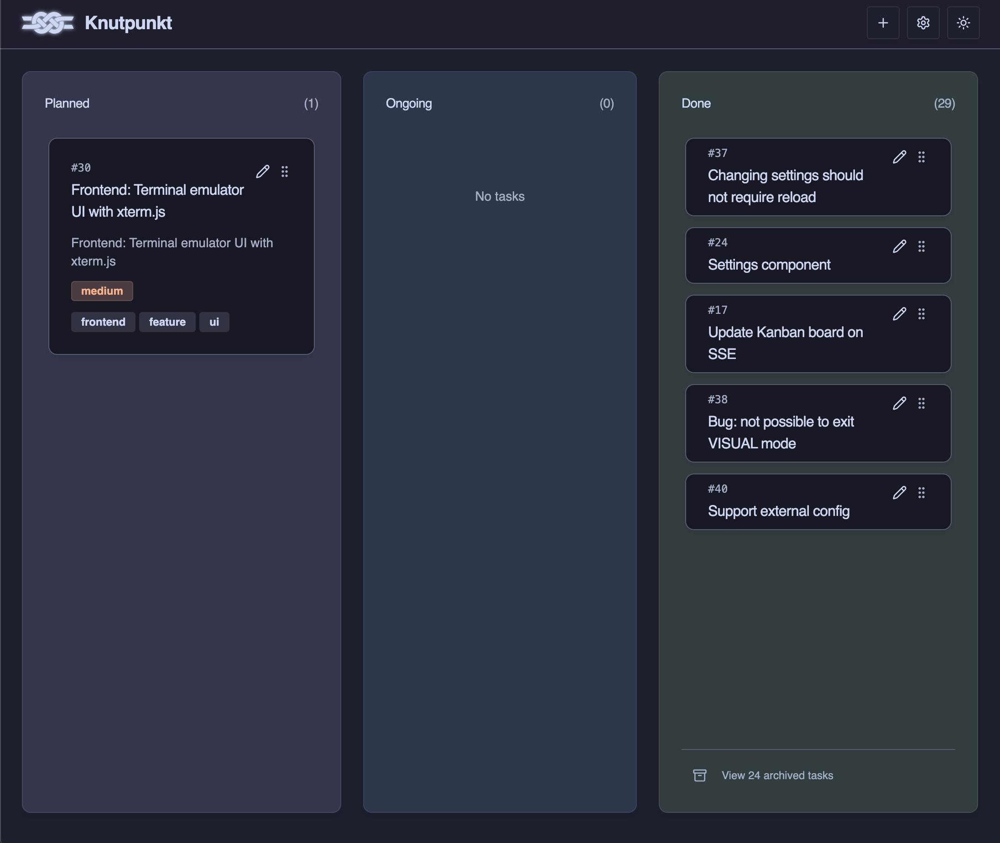
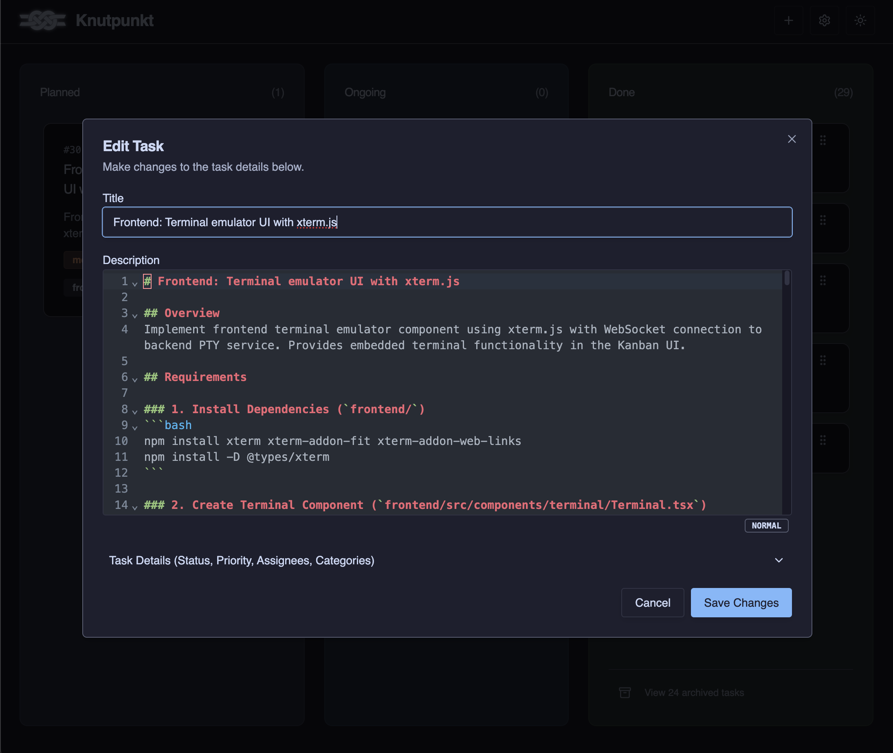

# Knutpunkt

A local Kanban board for humans and AI agents working together.

## Overview

Tasks are stored as Markdown files with YAML frontmatter in `tasks/{planned,ongoing,done}/` directories. The backend provides a REST API and Server-Sent Events for real-time updates. The frontend is a React application with drag-and-drop Kanban board interface.

### Screenshots


*Three-column Kanban board with task cards showing priorities and categories.*


*Built-in Markdown editor with syntax highlighting and Vim mode support.*

### Task file example

Example task file. The frontmatter contains metadata used and updated by the application.

```markdown
---
id: "012c13e7-0129-431a-9d48-fe14912d495b"
number: 33
title: "Indicate VIM mode"
createdAt: "2025-12-13T15:48:07.746557Z"
updatedAt: "2025-12-20T21:09:01.369841Z"
assignees:
- "Claude Code"
categories:
- "frontend"
priority: "medium"
order: 6
---

# Indicator showing VIM mode

## Overview

The MarkdownEditor has support for VIM mode. If it is active, a small below the MarkdownEditor should show this. Also, the current VIM editing mode of the MarkdownEditor should be printed (all modes available to the codemirro-vim plugin should be supported)

## Requirements

- When VIM mode is active, a text or label or other suitable UI element should indicate it just below the editor area.
- The current edit mode should also be indicated
- When VIM mode is not active, nothing should be displayed

## Acceptance Criteria

- [ ] Indicator and mode information is available for VIM mode
- [ ] When VIM mode is inactive, nothing is displayed%
```

## Features

- Kanban board with three columns (planned, ongoing, done)
- Drag-and-drop task ordering and status changes
- Real-time updates via Server-Sent Events
- File-based storage using Markdown with YAML frontmatter
- Task filtering and categorization
- MCP (Model Context Protocol) server for AI assistant integration

## Prerequisites

- Node.js 18+
- Java 17+
- Make (optional, for convenience commands)

## Quick Start

### Build

```bash
# Install frontend dependencies
cd frontend && npm install && cd ..

# Build both frontend and backend
make dist
```

This creates `build/knutpunkt-<version>.jar` containing the backend server and bundled frontend.

### Run

```bash
# Start the server (defaults to ./tasks directory)
./start.sh

# Or specify a custom tasks directory
./start.sh /path/to/tasks

# With debug logging
APP_LOG_LEVEL=DEBUG ./start.sh
```

Access the application at http://localhost:8080

### Environment Variables

- `PORT` - Server port (default: 8080)
- `HOST` - Server host (default: 0.0.0.0)
- `TASKS_DIRECTORY` - Tasks storage directory (default: ./tasks)
- `ENABLE_CACHE` - Enable task caching (default: true)
- `APP_LOG_LEVEL` - Application log level: DEBUG, INFO, WARN, ERROR (default: DEBUG)

## Development

### Frontend

```bash
cd frontend

# Development server with API mocks
npm run dev

# Development server with real backend
npm run dev:local

# Run tests
npm test

# Run tests with coverage
npm run test:coverage

# Type checking
npm run build  # includes tsc check

# Generate API types from OpenAPI spec
npm run generate-types

# Storybook
npm run storybook
```

The frontend runs on http://localhost:5173 (Vite default).

### Backend

```bash
cd backend

# Run development server
./gradlew run

# Run tests
./gradlew test

# Run tests with coverage
./gradlew test jacocoTestReport

# Build JAR only
./gradlew shadowJar
```

The backend runs on http://localhost:8080.

### Full Project

```bash
# Build everything
make build

# Run all tests (frontend + backend)
make test

# Run with coverage reports
make test-coverage

# Clean all build artifacts
make clean

# Show version
make version
```

### Project Structure

```
knutpunkt/
├── api/
│   └── openapi.yaml           # OpenAPI 3.0 API specification
├── frontend/                  # React/TypeScript frontend
│   ├── src/
│   │   ├── components/        # UI components (ShadCN + custom)
│   │   ├── hooks/            # React hooks
│   │   ├── lib/              # API client and utilities
│   │   └── types/            # TypeScript types
│   ├── public/               # Static assets
│   └── package.json
├── backend/                   # Kotlin/Ktor backend
│   └── src/main/kotlin/com/ninjacontrol/knutpunkt/
│       ├── Application.kt     # Entry point
│       ├── models/           # Data models
│       ├── services/         # Business logic
│       ├── routes/           # HTTP routes
│       ├── plugins/          # Ktor plugins
│       └── utils/            # Utilities
├── mcp-server/               # MCP server for AI integration
│   └── src/
├── tasks/                    # Task storage (file-based)
│   ├── planned/
│   ├── ongoing/
│   └── done/
├── Makefile                  # Build automation
└── start.sh                  # Startup script
```

## API

REST API is documented in `api/openapi.yaml` (OpenAPI 3.0).

Base URL: `http://localhost:8080/api/v1`

### Endpoints

- `GET /tasks` - List tasks (with filtering)
- `GET /tasks/{id}` - Get task by ID
- `POST /tasks` - Create task
- `PUT /tasks/{id}` - Update task
- `DELETE /tasks/{id}` - Delete task
- `PATCH /tasks/{id}/order` - Update task order/status
- `GET /events/tasks` - SSE stream of task events
- `GET /events/files` - SSE stream of file events
- `GET /settings` - Backend configuration
- `GET /version` - Version information

## MCP Server Integration

The MCP (Model Context Protocol) server enables AI assistants like Claude Code to interact with the Knutpunkt task board. It provides tools for creating, listing, claiming, and managing tasks through natural language commands.

**Setup**: See [docs/MCP_SERVER.md](docs/MCP_SERVER.md) for installation, configuration, and usage examples.

## Documentation

- [docs/MCP_SERVER.md](docs/MCP_SERVER.md) - MCP server setup and usage guide
- [docs/TASK_WRITING_GUIDE.md](docs/TASK_WRITING_GUIDE.md) - Guidelines for writing effective tasks
- [api/openapi.yaml](api/openapi.yaml) - Complete API specification

## License

MIT
